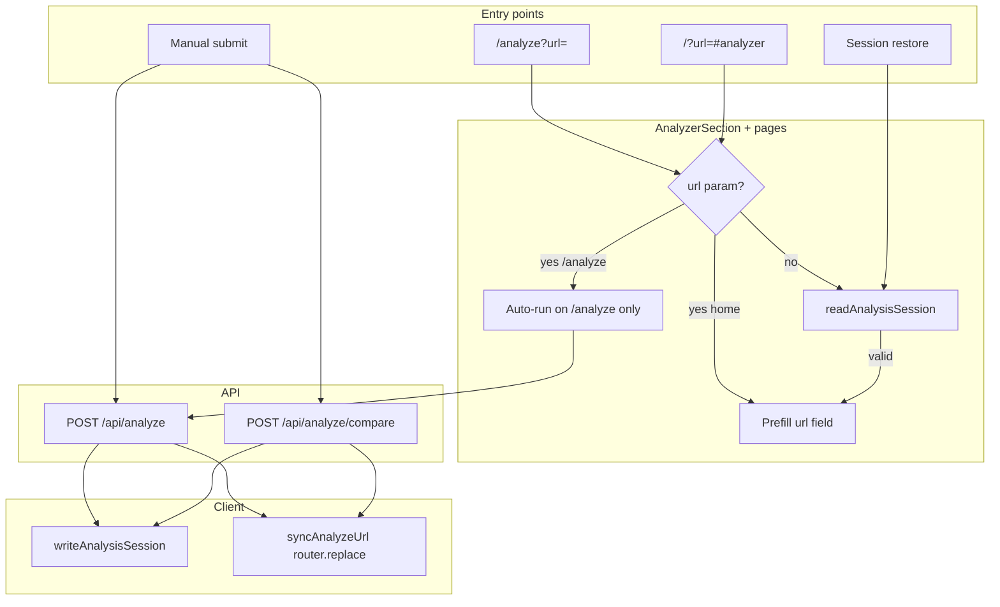

# Analysis & Workshop Elevation Design Spec

**Date:** 2026-06-07  
**Status:** Approved for Phase A implementation  
**Scope:** Analysis persistence, shareable analyze URLs, workshop chat elevation, component boundaries  
**Out of scope:** Agent takeover implementation (boundary doc only), Output SDK eval suite

---

## Executive summary

Silk Analyzer and Workshop Chat already share a solid spine: `AnalyzerFlowProvider` → `useSingleAnalyze` → `/api/analyze`, with `WorkshopChat` posting to `/api/chat` and grounding replies via `buildAnalysisChatSummary`. Gaps today:

1. **Results vanish on refresh** — no session restore; compare state lives only in `AnalyzerSection` local state.
2. **Shareable analyze URLs prefill only** — `/analyze?url=` and `/?url=` set the field but never auto-run; URL bar does not update after a successful analyze on home.
3. **Workshop chat is bare MVP** — no starter prompts, no structured “action plan” mode, context summary is overview-heavy.
4. **Compare mode is orphaned** — not in context, not persisted, no workshop chat on compare results.

**Chosen direction:** Phase A ships session persistence, URL sync + auto-run policy, and workshop chat elevation without restructuring compare into context. Phase B lifts compare into shared flow, chat persistence, and richer share UX.

---

## Patterns & conventions found

| Pattern | Location | Notes |
|---------|----------|-------|
| Client storage keys prefixed `archive-arac:` | `src/lib/reportStore.ts`, `vaultSync.ts`, `clientId.ts` | localStorage for durable vault; **sessionStorage** preferred for tab-scoped analysis |
| URL prefill via `useSearchParams().get("url")` | `src/app/analyze/page.tsx`, `src/app/page.tsx` | Passed to `AnalyzerFlowProvider` + `AnalyzerSection` as `initialUrl` |
| Strand deep link + no-reload close | `src/app/page.tsx` L35–43 | `router.replace(..., { scroll: false })` when clearing `?strand=` — **reuse for `?url=`** |
| Share link (compact token) | `src/lib/reportShare.ts` | `/report?s=` — distinct from analyze URL; keep both |
| Chat context builder | `src/lib/analysisChatContext.ts` | Truncated JSON string injected into system prompt |
| Single-analyze hook | `src/hooks/useSingleAnalyze.ts` | Owns url/status/result/submit; no persistence |
| Context = hook passthrough | `src/components/AnalyzerFlowContext.tsx` | Thin provider; compare not included |
| Compare orchestration | `src/components/AnalyzerSection.tsx` L29–94 | Local state + `/api/analyze/compare` |
| Workshop UI | `src/components/WorkshopChat.tsx` | Local messages; `result` prop only in single mode |

---

## Architecture decision

**Single responsibility split (commit to this):**

| Layer | Owns | Does not own |
|-------|------|--------------|
| `useSingleAnalyze` | Single URL, status, result, submit/reset, **persist/restore single result** | Compare, URL bar sync, chat |
| `AnalyzerFlowContext` | Provide hook instance app-wide (Hero + AnalyzerSection share URL) | Compare, chat, routing |
| `AnalyzerSection` | Mode toggle, compare fetch/state, scroll, strand modal wiring, **orchestrate restore + URL sync on mount/submit** | Chat API, analyze API logic |
| `useWorkshopChat` (new) | Messages, send, mode, starter prompt injection | Analysis fetch |
| `WorkshopChat` | Panel UI, a11y, scroll lock | Business logic (delegate to hook) |
| Pages (`page.tsx`, `analyze/page.tsx`) | Read searchParams, pass `initialUrl`, set **auto-run policy** | Form state |

**Rationale:** Hero and AnalyzerSection must share one URL field on home — context stays minimal. Compare is section-local in Phase A to avoid a large context refactor; persistence module accepts both modes so Phase B is a lift, not a rewrite.

**Trade-offs accepted:**
- Compare restore logic lives in `AnalyzerSection` until Phase B.
- sessionStorage (not Vault) — fast restore, no server sync, cleared when tab closes (by design).
- Auto-run on `/analyze?url=` only (not home `/?url=`) — avoids surprise API calls on landing page load.

---

## 1. Analysis persistence

### Storage choice

**sessionStorage** key: `archive-arac:analysis-session`

Why not localStorage: analysis is exploratory and large (`AnalysisResult` is ~50–200KB JSON). Tab scope matches user mental model (“I was just analyzing this”). Vault remains the durable save path via `saveToVault`.

### Schema (v1)

```typescript
// src/lib/analysisSessionStore.ts

export const ANALYSIS_SESSION_KEY = "archive-arac:analysis-session";
export const ANALYSIS_SESSION_TTL_MS = 24 * 60 * 60 * 1000; // optional, default 24h

export interface AnalysisSessionPayload {
  v: 1;
  savedAt: string; // ISO
  mode: "single" | "compare";
  /** Normalized URL(s) at time of save */
  urlA: string;
  urlB?: string;
  /** Present when mode === "single" */
  result?: AnalysisResult;
  /** Present when mode === "compare" */
  compare?: {
    a: AnalysisResult;
    b: AnalysisResult;
    comparison: SiteComparison;
  };
}
```

### API surface

```typescript
export function readAnalysisSession(): AnalysisSessionPayload | null;
export function writeAnalysisSession(payload: AnalysisSessionPayload): void;
export function clearAnalysisSession(): void;
export function isSessionExpired(payload: AnalysisSessionPayload, ttlMs?: number): boolean;
```

Implementation mirrors `reportStore.ts`: guard `typeof window`, try/catch JSON parse, return null on corruption/expiry.

### Write triggers

| Event | Action |
|-------|--------|
| Single analyze completes (`useSingleAnalyze.submit` success) | `writeAnalysisSession({ mode: "single", urlA, result })` |
| Compare completes (`AnalyzerSection.handleSubmit` success) | `writeAnalysisSession({ mode: "compare", urlA, urlB, compare })` |
| User switches mode (Analyze ↔ Compare) | `clearAnalysisSession()` + reset UI (existing reset paths) |
| Explicit “New analysis” (future button) | `clearAnalysisSession()` |

### Restore on mount

**Flow:**

1. `AnalyzerSection` mounts (or `useSingleAnalyze` init effect — prefer **section orchestrates** so compare restore stays in one place).
2. If `searchParams.url` is present → **skip restore** (URL param wins; may auto-run per §2).
3. Else `readAnalysisSession()` → if valid and not expired:
   - `mode === "single"`: `single.setUrl(urlA)`, `single.setResult(result)` (requires exposing `setResult` on hook), `setStatus("complete")`.
   - `mode === "compare"`: set local compare state + `single.setUrl(urlA)`, `setUrlB(urlB)`.
4. Optional: scroll to `#analyzer-results` after restore (respect `prefers-reduced-motion`).

**Hook change:** add `setResult` (and optionally `hydrateFromSession`) to `useSingleAnalyze` return — internal setter only used by restore path, not public form API.

### TTL

Default **24 hours**. On read, if `Date.now() - savedAt > TTL`, call `clearAnalysisSession()` and return null. TTL constant exported for tests; no UI for TTL config in Phase A.

---

## 2. Shareable analyze URL & query sync

### URL formats

| URL | Purpose |
|-----|---------|
| `/analyze?url=https://example.com` | Canonical share + dedicated analyzer page |
| `/?url=https://example.com#analyzer` | Home deep link (prefill + scroll to section) |
| `/report?s=<token>` | Existing compact share (unchanged) |

Add helper in `src/lib/reportShare.ts` (or `analyzeUrl.ts`):

```typescript
export function analyzeUrlFromHostname(url: string, origin: string, onHome = false): string {
  const encoded = encodeURIComponent(tryNormalizeCanonicalUrl(url));
  return onHome
    ? `${origin}/?url=${encoded}#analyzer`
    : `${origin}/analyze?url=${encoded}`;
}
```

Wire **ReportActions** “Copy analyze link” alongside existing share link (two buttons or split action).

### Auto-run policy

| Surface | `?url=` present | Behavior |
|---------|-----------------|----------|
| `/analyze` | yes | **Auto-run** once on mount (after provider ready) |
| `/` (home) | yes | Prefill only; user submits via Hero or AnalyzerSection |
| Either | no | Restore session if available (§1) |

Auto-run guard: ref `autoRunDone` per mount; skip if `single.result?.url` already matches normalized param (idempotent).

### Query sync after successful analyze (no full reload)

**Home (`src/app/page.tsx`):**

On successful single or compare submit from `AnalyzerSection`, call shared helper:

```typescript
// src/lib/analyzeUrlSync.ts
export function syncAnalyzeUrl(
  router: AppRouterInstance,
  pathname: string,
  searchParams: URLSearchParams,
  url: string,
  options?: { hash?: string }
): void;
```

- Normalize URL, compare to current `searchParams.get("url")`.
- If different: `router.replace(\`${pathname}?${params}#analyzer\`, { scroll: false })`.
- Preserve unrelated params (`strand`, etc.) — merge, don’t wipe.

**`/analyze` page:** same sync on submit (replace `?url=` only, no hash).

**Strand modal:** already fixed — `handleClose` uses `router.replace` with `scroll: false`. **Do not** navigate on strand open; only sync `?strand=` if product wants shareable strand links (existing behavior). Analysis URL sync must not trigger full page navigation or remount of `AnalyzerFlowProvider`.

### Data flow (URL + persistence)



---

## 3. Workshop chat elevation

### Starter prompts

New file: `src/data/workshopPrompts.ts`

Export functions (not static strings only — derive from result):

```typescript
export type WorkshopPrompt = { id: string; label: string; message: string };

export function getStarterPrompts(result: AnalysisResult): WorkshopPrompt[];
export function getActionPlanSeed(result: AnalysisResult): string;
```

**Prompt categories (show 4–6 chips when `messages.length === 0`):**

| ID | Label | Message template |
|----|-------|-------------------|
| `score` | What does my score mean? | Reference `result.overview.score` and vibe |
| `quick-wins` | Top 3 quick wins | Ask for prioritized fixes from problems list |
| `stack` | Explain my stack | Reference frameworks/libraries |
| `a11y` | Accessibility gaps | Reference `result.ux.accessibility` |
| `innovate` | How to stand out | Reference innovations + uniqueFeatures |
| `action-plan` | Build an action plan | Switches mode (below) |

UI: horizontal scroll chip row above empty state in `WorkshopChat`; clicking chip calls `send(message)` or sets mode then sends seed.

### Action-plan mode

**Client:** extend chat POST body:

```typescript
{
  messages: ChatMessage[];
  analysisContext: string | null;
  mode?: "open" | "action-plan"; // default "open"
}
```

**Server (`src/app/api/chat/route.ts`):** append mode-specific system suffix:

```text
action-plan mode:
- Output a numbered plan: Immediate (this week), Short-term (this month), Strategic (quarter).
- Each item: action, why (tie to analysis), effort (S/M/L).
- End with one suggested "first move" the user can do today.
- Use markdown headings and numbered lists; stay under ~600 tokens.
```

**Context enrichment:** extend `buildAnalysisChatSummary` with optional `variant: "default" | "action-plan"`:

- `action-plan` adds: full `problems`, `ux.accessibility.issues`, `ux.performance.issues`, `design.designIssues`, top 3 `interactionHighlights` where `!isInnovative`.

Keep default variant unchanged for token budget in open mode.

### Hook extraction

**New:** `src/hooks/useWorkshopChat.ts`

```typescript
export function useWorkshopChat(result: AnalysisResult | null | undefined) {
  // messages, busy, error, mode, setMode, send(text), sendPrompt(prompt)
}
```

`WorkshopChat.tsx` becomes mostly presentation; passes `result` into hook.

### Compare mode chat (Phase B)

Phase A: Workshop chat remains single-result only. Phase B: pass synthetic context from `buildCompareChatSummary(a, b, comparison)` when compare results visible.

---

## 4. Component boundaries

```
┌─────────────────────────────────────────────────────────────┐
│ page.tsx / analyze/page.tsx                                  │
│  • searchParams → initialUrl                                 │
│  • auto-run effect (/analyze only)                           │
│  • AnalyzerFlowProvider wrapper                              │
└──────────────────────────┬──────────────────────────────────┘
                           │
┌──────────────────────────▼──────────────────────────────────┐
│ AnalyzerFlowContext → useSingleAnalyze                       │
│  • url, setUrl, status, result, setResult, submit, reset     │
│  • writeAnalysisSession on submit success (single)           │
└──────────────────────────┬──────────────────────────────────┘
                           │
        ┌──────────────────┼──────────────────┐
        │                  │                  │
┌───────▼───────┐  ┌───────▼───────┐  ┌───────▼───────┐
│ Hero          │  │ AnalyzerSection│  │ (future)      │
│ submit() only │  │ compare state  │  │               │
│ scroll to #   │  │ restore/sync   │  │               │
│ analyzer      │  │ WorkshopChat   │  │               │
└───────────────┘  └───────┬───────┘  └───────────────┘
                           │
                  ┌────────▼────────┐
                  │ useWorkshopChat │
                  │ WorkshopChat UI │
                  └────────┬────────┘
                           │
                  ┌────────▼────────┐
                  │ POST /api/chat  │
                  │ + analysisCtx   │
                  └─────────────────┘
```

**Rules:**

- **Never** put compare state in context until Phase B.
- **Never** call `router` inside `useSingleAnalyze` — pages/section own navigation.
- **Never** persist chat messages in Phase A (sessionStorage budget + privacy); Phase B optional `archive-arac:workshop-thread` keyed by hostname.

---

## 5. Future agent takeover (boundary only)

**Not in scope.** Document the hard boundary for future work:

| Capability | Feasible in web panel | Requires |
|------------|----------------------|----------|
| Chat brainstorming on analysis | ✅ Today | `/api/chat` + context |
| Click/type automation on analyzed site | ❌ | Browser extension, Playwright session, or agent product with explicit user consent |
| “Implement this fix” on user's repo | ❌ | Separate IDE/agent integration |

**Extension point:** Workshop chat could emit structured `ActionPlanItem[]` JSON in Phase B; an future agent consumer would subscribe to that schema — not raw mouse events.

Reference: existing comment in `WorkshopChat.tsx` L14–18.

**Optional stub file (Phase B doc only):** `docs/superpowers/specs/future-workshop-agent-boundary.md` — defer creation until agent work is scheduled.

---

## 6. Quality assurance (no Output SDK eval suite)

This repo does **not** use Output SDK workflows or `@outputai/evals`. An `output-eval-audit` pass confirms there is no eval infrastructure to extend.

**Recommendation:** adopt a **lightweight manual QA checklist** for Phase A sign-off (run before merge):

### Analysis & persistence

- [ ] Analyze single URL → refresh tab → results restore within 24h TTL
- [ ] Open `/analyze?url=<known-good>` → auto-runs without second click
- [ ] Home `/?url=<site>#analyzer` → prefills, does **not** auto-run until submit
- [ ] After analyze on home, address bar shows `?url=` without full page reload
- [ ] Switch Analyze ↔ Compare clears session and results
- [ ] Expired session (>24h mocked via devtools) → clean idle state

### URL & modals

- [ ] Open strand from results on home → modal opens; closing does not reload page
- [ ] `?strand=` deep link still opens modal; closing strips param with `scroll: false`
- [ ] Copy analyze link → open in new tab → correct prefill/auto-run behavior

### Workshop chat

- [ ] Starter prompts visible with analysis loaded; hidden after first message
- [ ] “Build an action plan” produces structured numbered plan referencing real score/issues
- [ ] Chat without result (edge: cleared result) → general workshop answers, no hallucinated scores
- [ ] Error state when chat API unavailable shows user-visible message

### Compare (regression)

- [ ] Compare two URLs still works; session restore brings back both panels
- [ ] Compare path does not show Workshop chat in Phase A (expected)

---

## Implementation map

### Create

| File | Responsibility |
|------|----------------|
| `src/lib/analysisSessionStore.ts` | Schema, read/write/clear/TTL |
| `src/lib/analyzeUrlSync.ts` | `syncAnalyzeUrl`, `analyzeUrlFromHostname` |
| `src/data/workshopPrompts.ts` | Starter prompts + action-plan seed |
| `src/hooks/useWorkshopChat.ts` | Chat state, send, mode |

### Modify

| File | Changes |
|------|---------|
| `src/hooks/useSingleAnalyze.ts` | `setResult`; persist on submit success; optional restore callback |
| `src/components/AnalyzerFlowContext.tsx` | No logic change; types follow hook |
| `src/components/AnalyzerSection.tsx` | Restore orchestration; compare persist; URL sync callback prop or internal router hook |
| `src/app/page.tsx` | Pass sync handler; document auto-run = off |
| `src/app/analyze/page.tsx` | Auto-run effect when `?url=` |
| `src/lib/analysisChatContext.ts` | `variant` param; `buildCompareChatSummary` stub for Phase B |
| `src/lib/reportShare.ts` | Export `analyzeUrlFromHostname` |
| `src/components/analyzer/ReportActions.tsx` | “Copy analyze link” button |
| `src/components/WorkshopChat.tsx` | Starter chips, mode toggle UI, delegate to hook |
| `src/app/api/chat/route.ts` | `mode` param; action-plan system suffix |

### Do not modify (Phase A)

- `/api/analyze/route.ts` — stable
- `Modal.tsx` — strand no-reload already correct
- Vault / report token flow

---

## Build sequence

### Phase A — Ship now

- [ ] **A1** `analysisSessionStore.ts` + unit-less manual test via devtools
- [ ] **A2** Hook persistence write + `setResult`; single-mode restore
- [ ] **A3** Compare persist/restore in `AnalyzerSection`
- [ ] **A4** `/analyze?url=` auto-run + `analyzeUrlSync` on home and `/analyze`
- [ ] **A5** `workshopPrompts.ts` + starter chips UI
- [ ] **A6** `useWorkshopChat` + action-plan mode (API + context variant)
- [ ] **A7** ReportActions analyze link
- [ ] **A8** Manual QA checklist pass

### Phase B — Later

- [ ] Lift compare into `useCompareAnalyze` or extended context
- [ ] `buildCompareChatSummary` + WorkshopChat on compare results
- [ ] Optional chat thread persistence (sessionStorage, hostname-keyed)
- [ ] `?compare=a&b=` share URL format
- [ ] Structured `ActionPlanItem[]` response schema for future agents
- [ ] `docs/superpowers/specs/future-workshop-agent-boundary.md`

---

## Critical details

### Error handling

- sessionStorage quota exceeded: catch `QuotaExceededError`, log once, skip write (analysis still visible; user can Vault save).
- Restore with corrupt JSON: clear key, fall through to idle.
- Auto-run fetch failure: show existing error UI; do not loop retry.

### Security

- Never put full `AnalysisResult` in URL query string (size + leakage). Use `/report?s=` for rich share or `/analyze?url=` for re-fetch.
- Chat context stays server-side assembly; client sends pre-built summary string (existing pattern).

### Performance

- Debounce URL sync (100ms) if submit and restore fire close together.
- sessionStorage write on success only, not on every keystroke.

### Accessibility

- Starter prompt chips: keyboard focusable, `role="list"` / `role="listitem"`.
- Action-plan replies: assistant message renders markdown safely (existing plain text OK for Phase A; consider `prose` + sanitizer in Phase B).

---

## Key decisions summary

| Decision | Choice |
|----------|--------|
| Persistence store | sessionStorage `archive-arac:analysis-session`, v1 schema |
| TTL | 24h default, silent expiry on read |
| Auto-run | `/analyze?url=` yes; home `/?url=` no |
| URL sync | `router.replace` + `scroll: false`; preserve other query params |
| Compare ownership | Stays in `AnalyzerSection` Phase A; persisted in shared store |
| Chat architecture | New `useWorkshopChat`; action-plan via API `mode` param |
| Context builder | `buildAnalysisChatSummary(result, { variant })` |
| Agent automation | Out of scope; chat-only boundary documented |
| Testing | Manual QA checklist (no Output SDK evals in repo) |

---

*End of spec.*
